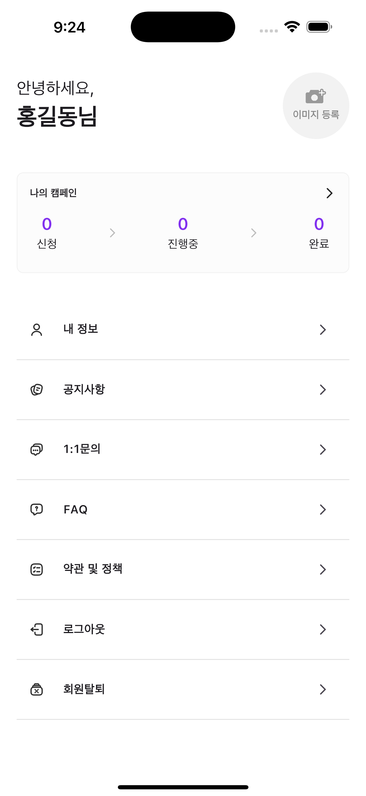
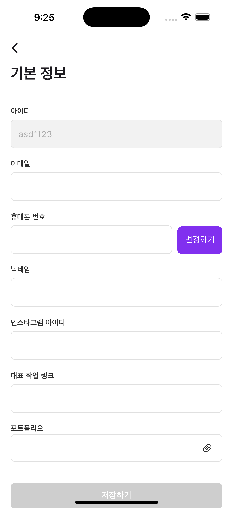

#  🛠️ Project Summary – My Flyn
## Project Description

 - My Flyn is a Flutter project implementing a campaign management system with features such as:
 - Campaign listing and status tracking (CampaignListViewWidget, CampaignStatusWidget)
 - User and profile management (MyInformationPage, SetPasswordPage)
 - Reactive UI using GetX for state management
 - The project follows clean architecture with data, domain, and presentation layers, using repositories, use-cases, and mappers.

<pre>

lib/
├── core/                            # Core logic like networking and error handling
│   ├── error/                       # Custom error classes and handlers
│   └── network/                     # API clients, interceptors, etc.
│
├── get_it_configuration/           # Dependency injection setup using get_it
│
├── src/
│   ├── app/
│   │   └── home/                    # Home feature module
│   │       ├── data/               # Data layer
│   │       │   ├── models/         # Data Transfer Objects (DTOs)
│   │       │   ├── mappers/        # Map DTOs ↔ domain entities
│   │       │   ├── repositories/   # Repository implementations
│   │       │   └── datasources/    # API or local data source logic
│   │       │
│   │       ├── domain/             # Domain layer
│   │       │   ├── entities/       # Business models
│   │       │   ├── repositories/   # Abstract repository interfaces
│   │       │   └── usecases/       # Business rules / application logic
│   │       │
│   │       └── presentations/      # UI layer (MVVM / MVC / Clean UI)
│   │           ├── controller/     # View models / logic controllers
│   │           ├── pages/          # Screens and pages
│   │           └── widgets/        # Feature-specific UI components
│
│   ├── common/                     # Reusable widgets, constants, themes, etc.
│   ├── routes/                     # Route definitions and navigation logic
│   └── utils/                      # Utilities, config files, mock data, etc.

</pre>

## Highlights:
 - Clean separation of View / Controller / Domain / Data layers
 - GetX controllers in controller/ folder
 - Modular widgets for reuse (common/widgets/ and presentations/widgets/)
 - Network & error handling in core/

## Dependencies

 - State Management: get: ^4.7.2
 - Dependency Injection: get_it + injectable
 - Navigation: go_router
 - File/Image Picking: image_picker, file_picker
 - Other: flutter_svg, equatable, dartz

## Running the Project
### 1. Clone repo:

    git clone https://github.com/bhargav28/my_flyn.git
  
    cd my_flyn

### 2. Install dependencies:

    flutter pub get

### 3. Code generation

    flutter packages pub run build_runner build --delete-conflicting-outputs

### 4. Run on Emulator/Device

    flutter run

### 5. Build release version

    flutter build apk --release

## Implementation Decisions

 - Architecture: Clean architecture with data, domain, presentation separation
 - State Management: GetX (Rx + Obx) for reactive UI updates
 - DI: Used get_it with injectable for automatic dependency injection
 - Permissions: Handled camera, gallery, and file access with runtime checks
 - Routing: go_router for type-safe and declarative navigation
 - Reusability: Common widgets & helpers for consistency

## 📦 Download APK
[⬇️ Download Latest Release](https://github.com/bhargav28/my_flyn/releases/tag/v1.0.0)

## Screenshots

       

       

